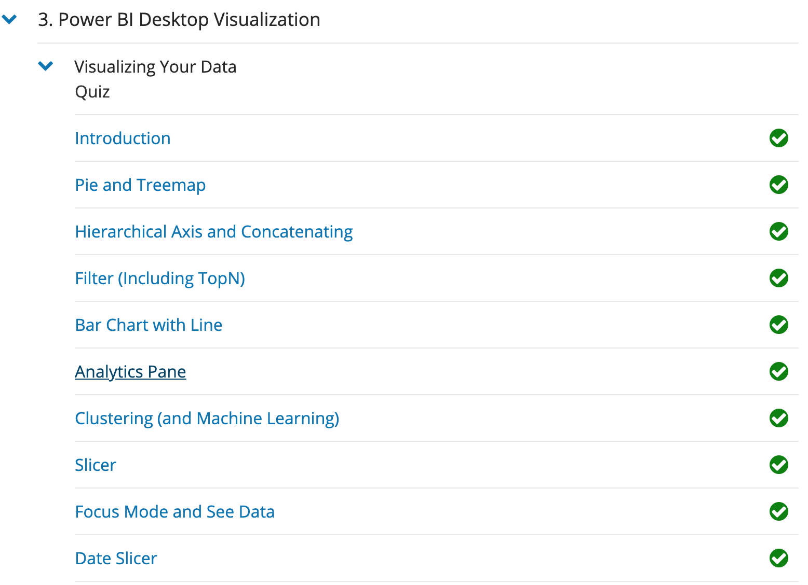
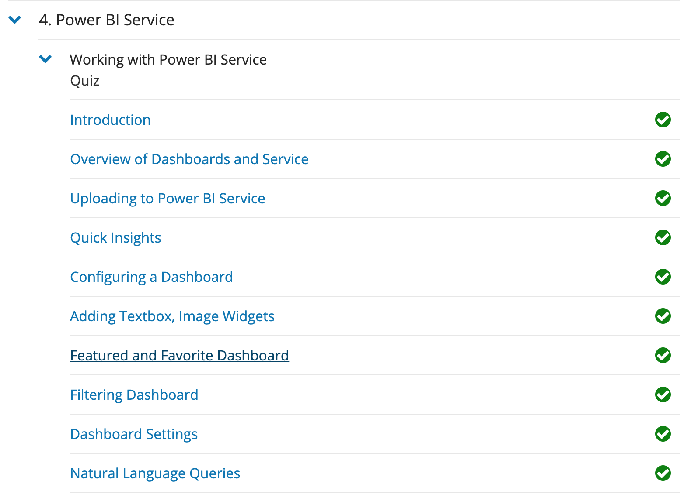
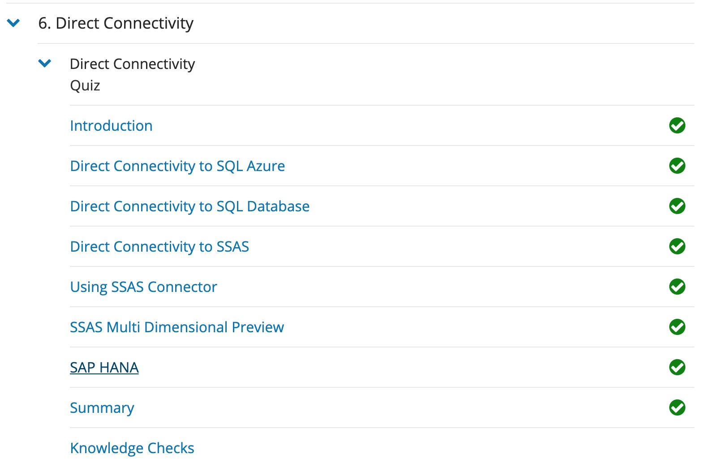

My Name is Andrew Walker and I'm a student at The University of Tulsa. 
I've spent the last 4 years learning everything relating to the Information Technology industry -- from object-oriented programming,  to SQL databases, and cybersecurity. 
I'm currently applying this knowledge in my role as a Service Center Trainer for QuikTrip Corporation, where I'm responsible for      writing knowledge articles, performing initial and ongoing training for analysts, and collaborating with developers to align our     processes.

<h1> Technical Skills and Certifications </h1>

Click on the arrows below to expand added content for each technical skill

<h2> Technical Skills </h2>

  
GitHub

<h5> Description: </h5>
Completed 12 introductory courses from lab.github.com/courses

The 12 GitHub labs include an overview of fundamental GitHub skills including:
<ul>
<li>GitHub page navigation</li>
<li>Issues, pull requests, and the structure of a GitHub repository</li>
<li>Formatting content using Markdown</li>
<li>Creating and merging Pull Requests</li>
<li>Publishing repositories using GitHub Pages</li>
<li>Contributing to repositories in the GitHub community</li>
<li>Uploading existing projects to GitHub</li>
<li>Review and Accept a pull request</li>
<li>Enable security features and detect vulnerable dependencies in repositories</li> 
<li>Utilize best practices to keep sensitive data out of repositories</li>
<li>Automate and document release changes</li>
<li>Resolve bugs after a release</li>
</ul>

<h5> Course Completion: </h5>

 

LINUX

<h5> Description: </h5>
Completed LPI Linux Essentials course offered by linuxacademy.com

The LPI Linux Essentials course included an overview of the major components of the Linux operating system and understanding of security and administration related topics to include:

<ul>
  <li>Linux Evolution and Popular Operating Systems</li>
  <li>How to Access a Linux Installation</li>
  <li>Major Open Source Applications</li>
  <li>Understanding Open Source Software and Licensing</li>
  <li>ICT Skills and Working in Linux</li>
  <li>Command Line Basics</li>
  <li>Use Command Line Basics to Get Help</li>
  <li>Use Directories and List Files</li>
  <li>Create, Move, and Delete Files</li>
  <li>Archive Files on the Command Line</li>
  <li>Search and Extract Data from Files</li>
  <li>Turn Commands into a Script</li>
  <li>Choose an Operating System</li>
  <li>Understand Computer Hardware</li>
  <li>Where Data is Stored</li>
  <li>Your Computer on the Network</li>
  <li>Basic Security and Identifying User Types</li>
  <li>Create Users and Groups </li>
  <li>Mane File Permissions and Ownership</li>
  <li>Special Directories and Files</li>
</ul>

<h5> Course Completion: </h5>

 

  
Amazon Web Services Essentials

<h5> Description: </h5>
Completed AWS Essentials course offered by linuxacademy.com

The AWS Essentials course included an overview of fundamental Amazon Web Services products and capabilities to include:

<ul>
  <li>Account Basics</li>
  <li>Managing AWS Access with Users, Groups, and Roles</li>
  <li>Networking Services and Connectiviy</li>
  <li>Virtual Privat Cloud (VPC)</li>
  <li>Compute Services</li>
  <li>Elastic Cloud Compute (EC2)</li>
  <li>Storage Services</li>
  <li>Database Services</li>
  <li>Monitoring, Alerts, and Notifications</li>
  <li>Simple Notification Service (SNS)</li>
  <li>Management Tools</li>
  <li>Load Balancing, Elasticity, and Scalability</li>
  <li>Auto Scaling</li>
  <li>Route 53</li>
  <li>Serverless Compute</li>
</ul>

<h5> Course Completion: </h5>

 

POWER BI

<h5> Description: </h5>
Completed Power BI course offered by EdX at https://powerbi.microsoft.com/en-us/learning/ 

The 8 Power BI modules provided an overview of fundamental data analysis and visualization to include:

<ul>
  <li>Get Clean and Transformed Data into Power BI</li>
  <li>Model Data by Calculated Columns, Tables, and Data Model</li>
  <li>Visual Data with Charts, Graphs, Slicers, and Conditional Formatting</li>
  <li>Design Dashboards to Communicate a User’s Story</li>
  <li>Format Excel to Use Compatibly with Power BI</li>
  <li>Manage and Update both Data Content and Security</li>
  <li>Construct Connections to Servers</li>
  <li>Publish Power BI Dashboards and Reports</li>
  <li>DAX functions, Tables, and Filtering</li>
</ul>

<h5> Course Completion: </h5>

 

  
Virtual Private Network

<h5> Description: </h5>
Set up IPsec VPN cloud server in DigitalOcean using open source ansible scripts form https://github.com/trailofbits/algo
Set up OpenVPN cloud server on Ubuntu 18.04 in Digital Ocean https://www.digitalocean.com/community/tutorials/how-to-set-up-an-openvpn-server-on-ubuntu-18-04

The 12 GitHub labs include an overview of fundamental GitHub skills including:
<ul>
<li>Algo IPSec VPN automatically deploys an on-demand VPN service in the cloud that is not shared with other users</li>
<li>OpenVPN is a full-featured, open-source Secure Socket Layer (SSL) VPN solution that accommodates a wide range of configurations</li>
<li>Configured to access it from Windows, macOS, iOS and/or Android</li>
<li>Both VPNs install to DigitalOcean, Amazon, Google, Azure or your own server</li>

</ul>

<h5> Course Completion: </h5>

<h2> Certifications </h2>

 Security + 

<h5>Description:</h5>
Throughout the Spring 2019 semester read CompTIA Security+ Get Certified Get Ahead SY0-501 Study Guide and plan to take the certification exam Summer 2019.

The Security + certification offers an overview of important cybersecurity concepts including:

<ul>
<li>Threats, Attacks and Vulnerabilities</li>
<li>Technologies and Tools </li>
<li>Architecture and Design</li>
<li>Identity and Access Management </li>
<li>Risk Management</li>
<li>Cryptography and PKI</li>
<ul>

